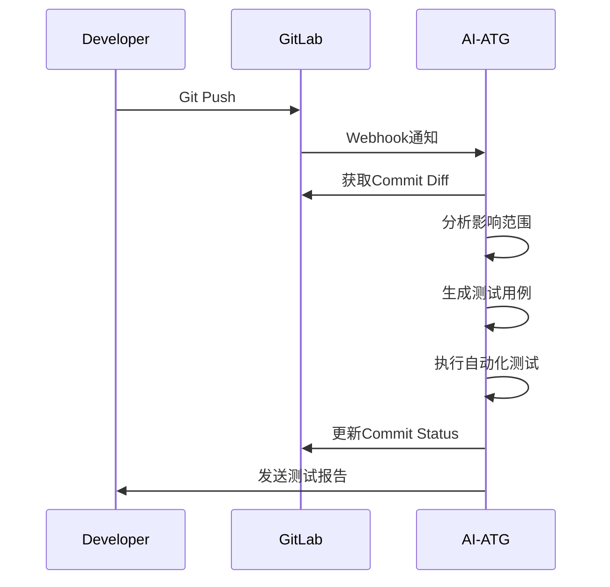
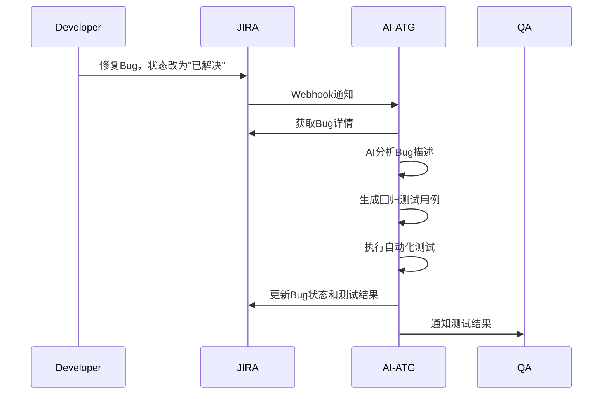
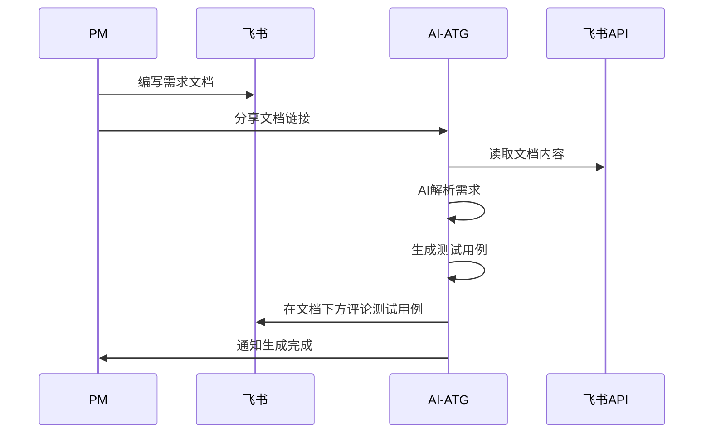

# AI-ATG 产品说明文档

> **AI-Powered Automated Test Generation**  
> 让测试更智能，让开发更高效

---

## 目录

- [第一部分：AI-ATG 介绍](#第一部分ai-atg-介绍)
- [第二部分：核心功能模块](#第二部分核心功能模块)
- [第三部分：ATG 技术原理](#第三部分atg-技术原理)
- [第四部分：核心价值](#第四部分核心价值)
- [第五部分：万物互联](#第五部分万物互联)
- [第六部分：实用技巧](#第六部分实用技巧)

---

## 第一部分：AI-ATG 介绍

### 1.1 产品概述

**AI-ATG**（AI-Powered Automated Test Generation）是一款基于人工智能技术的自动化测试平台，旨在解决传统软件测试中效率低、覆盖率不足、维护成本高等痛点。

通过融合大语言模型（LLM）和智能代理技术，AI-ATG能够：
- 🤖 **自动生成测试用例** - 从需求文档、代码变更、Bug记录中智能提取测试场景
- 🚀 **自动生成执行脚本** - 将测试用例转换为可执行的自动化测试脚本
- ⚡ **自动执行测试** - 支持UI、API、性能等多种测试类型的自动化执行
- 📊 **智能分析报告** - 生成专业的测试报告，并提供人工确认机制

### 1.2 产品定位

AI-ATG定位于**新一代智能化测试平台**，致力于：

- **降低测试门槛** - 让非技术人员也能轻松参与测试
- **提升测试效率** - 将测试用例生成时间从小时缩短到分钟
- **保证测试质量** - AI辅助但不替代人工，建立人机协同的测试体系
- **赋能DevOps** - 无缝集成到CI/CD流程，实现真正的持续测试

### 1.3 适用场景

AI-ATG适用于以下团队和场景：

✅ **敏捷开发团队** - 快速迭代，需要高效的回归测试  
✅ **中小型团队** - 测试资源有限，需要自动化提升效率  
✅ **大型企业** - 需要标准化的测试流程和质量管控  
✅ **外包团队** - 需要快速交付高质量的测试结果  
✅ **DevOps实践者** - 追求CI/CD流程的完整闭环  

---

## 第二部分：核心功能模块

### 2.1 项目管理

**功能概述**：  
提供多项目管理能力，支持项目创建、配置、成员管理等功能。

**核心特性**：
- 📁 多项目并行管理
- 👥 成员角色权限控制
- 🔧 项目级配置管理（测试环境、数据源等）
- 📊 项目级统计报表

**使用场景**：
```
某企业有多条产品线（Web端、移动端、后台服务），
通过项目管理功能，每条产品线独立管理测试用例和执行计划。
```

### 2.2 测试用例管理

**功能概述**：  
提供完整的测试用例生命周期管理，支持手动创建、AI生成、导入导出等多种方式。

**核心特性**：
- ✍️ 手动编写测试用例
- 🤖 AI智能生成测试用例
  - 从需求文档生成
  - 从代码变更生成
  - 从Bug记录生成
- 📥 批量导入/导出（支持Excel、JSON等格式）
- 🏷️ 测试用例分类标签
- 🔍 强大的搜索和筛选
- 📝 测试步骤详细记录

**AI生成示例**：
```markdown
输入：需求文档 - "用户登录功能"
输出：
1. 正常登录用例：输入正确用户名密码，验证登录成功
2. 密码错误用例：输入错误密码，验证提示错误信息
3. 用户名不存在用例：输入不存在的用户名，验证提示错误
4. 空密码用例：不输入密码，验证表单校验
5. SQL注入测试用例：输入特殊字符，验证安全性
... 共生成25个测试用例
```

### 2.3 测试套件管理

**功能概述**：  
将相关测试用例组织成套件，便于批量执行和管理。

**核心特性**：
- 📦 创建测试套件
- ➕ 灵活添加/移除用例
- 🎯 按优先级、标签筛选用例
- 🔄 支持套件复用
- ⚙️ 套件级执行配置

**典型套件示例**：
```
冒烟测试套件 → 包含核心功能的快速验证用例（执行时间<5分钟）
回归测试套件 → 包含全量功能用例（执行时间1-2小时）
性能测试套件 → 包含压力测试和性能监控用例
```

### 2.4 测试执行引擎

**功能概述**：  
支持本地和远程执行，提供实时监控和日志记录。

**核心特性**：
- 🖥️ **本地执行** - ATG-Client本地执行，支持Windows/Mac/Linux
- ☁️ **远程执行** - 服务端调度，分布式执行
- 📡 **实时监控** - 执行进度、日志实时推送
- 🎥 **截图录屏** - 失败用例自动截图
- 🔄 **失败重试** - 可配置自动重试次数
- ⏸️ **暂停恢复** - 支持执行过程中暂停和恢复

**执行流程**：
```
触发执行 → 选择套件 → 分配资源 → 并行执行 → 收集结果 → 生成报告
```

### 2.5 测试报告

**功能概述**：  
自动生成专业的测试报告，支持多种格式导出和人工确认机制。

**核心特性**：
- 📊 **自动生成** - 测试完成后自动生成HTML报告
- ✅ **人工确认机制** - 支持测试结果的人工审核和确认
- 📈 **统计分析** - 通过率、失败率、执行时长等
- 📉 **趋势分析** - 多次执行的对比和趋势
- 📄 **多格式导出** - HTML、PDF、Excel
- 🔔 **通知推送** - 支持邮件、飞书、钉钉等

**报告确认流程**：
```
自动生成 → 待确认 → 测试负责人审核 → 确认通过/失败 → 归档
```

### 2.6 数据管理

**功能概述**：  
提供测试数据管理能力，支持数据准备、参数化、数据驱动测试。

**核心特性**：
- 💾 测试数据集管理
- 🔄 数据参数化
- 📊 数据驱动测试
- 🎲 随机数据生成
- 🔐 敏感数据脱敏

### 2.7 环境管理

**功能概述**：  
管理多套测试环境（开发、测试、预发布、生产），支持环境切换。

**核心特性**：
- 🌍 多环境配置
- 🔀 一键切换环境
- 🔧 环境变量管理
- 🔗 数据库连接配置
- 🌐 API Base URL配置

---

## 第三部分：ATG 技术原理

### 3.1 系统架构

AI-ATG采用**前后端分离 + 客户端执行**的架构设计：

```
┌─────────────────────────────────────────────────────┐
│                   前端（Vue.js）                       │
│  项目管理 | 用例管理 | 执行监控 | 报告查看               │
└────────────────────┬────────────────────────────────┘
                     │ HTTP/WebSocket
┌────────────────────┴────────────────────────────────┐
│              后端服务（Spring Boot）                   │
│ ┌──────────┐  ┌──────────┐  ┌──────────┐            │
│ │用例服务  │  │执行服务  │  │报告服务  │            │
│ └──────────┘  └──────────┘  └──────────┘            │
│ ┌──────────────────────────────────────┐            │
│ │      AI服务（LLM集成）                │            │
│ │  用例生成 | 脚本生成 | 智能分析        │            │
│ └──────────────────────────────────────┘            │
└────────────────────┬────────────────────────────────┘
                     │ HTTP Callback
┌────────────────────┴────────────────────────────────┐
│            ATG-Client（本地执行客户端）                │
│  ┌──────────┐  ┌──────────┐  ┌──────────┐          │
│  │Selenium │  │ HTTP测试 │  │JMeter集成│          │
│  └──────────┘  └──────────┘  └──────────┘          │
└─────────────────────────────────────────────────────┘
```

### 3.2 AI引擎

**3.2.1 大语言模型（LLM）集成**

AI-ATG集成了主流的大语言模型，用于智能生成测试用例和脚本：

- **OpenAI GPT-4** - 高质量的文本理解和生成
- **Claude** - 更好的代码理解能力
- **本地部署模型** - 支持企业私有化部署

**工作流程**：
```
输入源（需求/代码/Bug）
    ↓ 
文档解析和预处理
    ↓
Prompt工程（专业测试提示词）
    ↓
LLM推理生成
    ↓
结果解析和格式化
    ↓
输出测试用例/脚本
```

**3.2.2 提示词工程（Prompt Engineering）**

针对不同输入源，设计了专门的提示词模板：

```python
# 需求文档生成用例的提示词模板
prompt = f"""
你是一位资深的软件测试工程师。请根据以下需求文档，生成完整的测试用例。

需求文档：
{requirement_doc}

请生成以下类型的测试用例：
1. 功能测试用例 - 覆盖所有功能点
2. 边界值测试用例 - 测试输入边界
3. 异常测试用例 - 测试错误处理
4. 安全测试用例 - 测试安全漏洞
5. 性能测试用例 - 测试响应时间

每个测试用例应包含：
- 用例标题
- 前置条件
- 测试步骤
- 预期结果
- 优先级

输出格式：JSON数组
"""
```

### 3.3 脚本生成引擎

**3.3.1 UI自动化脚本生成**

将测试用例转换为Selenium WebDriver脚本：

```javascript
// 输入：测试用例（JSON格式）
{
  "title": "用户登录测试",
  "steps": [
    { "action": "打开", "target": "登录页面" },
    { "action": "输入", "element": "用户名", "value": "testuser" },
    { "action": "输入", "element": "密码", "value": "123456" },
    { "action": "点击", "element": "登录按钮" },
    { "action": "验证", "element": "欢迎信息", "expected": "欢迎，testuser" }
  ]
}

// 输出：可执行的脚本
[
  { "action": "open", "input": "https://example.com/login" },
  { "action": "input", "locator": "css", "value": "#username", "input": "testuser" },
  { "action": "input", "locator": "css", "value": "#password", "input": "123456" },
  { "action": "click", "locator": "css", "value": "button[type='submit']" },
  { "action": "assertText", "locator": "css", "value": ".welcome", "input": "欢迎，testuser" }
]
```

**3.3.2 API自动化脚本生成**

```javascript
// 输入：API测试用例
{
  "api": "用户登录接口",
  "method": "POST",
  "url": "/api/v1/login",
  "params": {
    "username": "testuser",
    "password": "123456"
  },
  "expected": {
    "status": 200,
    "body.code": 0,
    "body.data.token": "存在"
  }
}

// 输出：HTTP请求脚本
{
  "method": "POST",
  "url": "${baseUrl}/api/v1/login",
  "headers": {
    "Content-Type": "application/json"
  },
  "body": {
    "username": "testuser",
    "password": "123456"
  },
  "assertions": [
    { "type": "status", "expected": 200 },
    { "type": "jsonPath", "path": "$.code", "expected": 0 },
    { "type": "jsonPath", "path": "$.data.token", "operator": "exists" }
  ]
}
```

### 3.4 执行引擎

**3.4.1 本地执行模式（ATG-Client）**

ATG-Client是一个轻量级的本地执行客户端：

**技术栈**：
- Node.js + Electron（跨平台支持）
- Selenium WebDriver（浏览器自动化）
- Axios（HTTP请求）
- WebSocket（实时通信）

**执行流程**：
```
1. 接收服务端指令
   ↓
2. 解析测试脚本
   ↓
3. 启动浏览器/发起请求
   ↓
4. 执行测试步骤
   ↓
5. 收集执行日志和截图
   ↓
6. 回调结果到服务端
```

**3.4.2 分布式执行**

支持多机并行执行，提升测试效率：

```
服务端调度器
    ↓
分配任务到多个ATG-Client
    ↓
Client1: 执行用例1-10
Client2: 执行用例11-20
Client3: 执行用例21-30
    ↓
汇总执行结果
```

### 3.5 数据流转

完整的数据流转过程：

```
需求/代码/Bug（输入源）
    ↓
AI解析生成用例
    ↓
用例存储（MySQL数据库）
    ↓
脚本生成引擎
    ↓
脚本存储（JSON格式）
    ↓
执行引擎调度
    ↓
ATG-Client执行
    ↓
执行结果回调
    ↓
报告生成服务
    ↓
报告存储和展示
```

### 3.6 关键技术

- **Selenium WebDriver** - UI自动化核心
- **Spring Boot** - 后端服务框架
- **Vue.js + Element UI** - 前端框架
- **MySQL** - 数据存储
- **WebSocket** - 实时通信
- **LangChain** - LLM应用框架
- **Node.js** - 客户端运行时

---

## 第四部分：核心价值

### 4.1 覆盖五大场景

AI-ATG能够覆盖软件测试的各个阶段和来源，实现全场景测试自动化：

#### 4.1.1 代码变更影响范围生成用例并自动化测试

**场景描述**：  
开发人员提交代码变更后，AI-ATG自动分析变更影响范围，生成针对性测试用例并执行。

**工作流程**：
```
Git Push
    ↓
GitLab Webhook通知ATG
    ↓
分析代码变更（Diff分析）
    ↓
识别影响的功能模块
    ↓
AI生成回归测试用例
    ↓
自动执行测试
    ↓
反馈测试结果
```

**价值**：
- ✅ **快速反馈** - 代码提交后5分钟内完成测试
- ✅ **精准测试** - 只测试受影响的功能，节省时间
- ✅ **降低风险** - 及早发现代码变更引入的Bug

**实际案例**：
```
场景：修改了用户登录模块的密码加密逻辑

传统方式：
- 手动编写测试用例：30分钟
- 执行全量回归测试：2小时
- 总计：2.5小时

AI-ATG方式：
- AI自动生成用例：2分钟
- 精准执行受影响用例：10分钟
- 总计：12分钟

效率提升：12.5倍
```

#### 4.1.2 需求文档生成测试用例并自动化测试

**场景描述**：  
产品经理提供需求文档（Word、Markdown、飞书文档等），AI-ATG自动解析并生成测试用例。

**工作流程**：
```
上传需求文档
    ↓
文档解析（OCR + NLP）
    ↓
提取功能点和业务规则
    ↓
AI生成测试用例
    ↓
人工审核（可选）
    ↓
生成自动化脚本
    ↓
执行测试
```

**价值**：
- ✅ **降低门槛** - 不懂技术也能生成测试用例
- ✅ **提前介入** - 需求阶段就开始测试准备
- ✅ **需求验证** - 帮助发现需求的不明确和遗漏

**支持的文档格式**：
- 📄 Word文档（.doc, .docx）
- 📝 Markdown文档（.md）
- 📊 飞书文档/腾讯文档
- 🔗 在线文档链接
- 📋 纯文本（.txt）

**实际案例**：
```
输入：10页的需求文档 - "电商下单流程优化"

输出：
- 功能测试用例：35个
- 边界测试用例：20个
- 异常测试用例：15个
- 安全测试用例：8个
- 性能测试用例：5个
共计：83个测试用例

生成时间：3分钟
人工编写相同用例预计：4小时
```

#### 4.1.3 JIRA等平台上的Bug生成测试用例并自动化测试

**场景描述**：  
从Bug管理平台（JIRA、禅道、Bugzilla等）获取Bug信息，自动生成回归测试用例。

**工作流程**：
```
监听Bug状态变更
    ↓
Bug状态 = "已修复"
    ↓
提取Bug描述和复现步骤
    ↓
AI生成回归测试用例
    ↓
执行自动化测试
    ↓
验证Bug是否修复
    ↓
更新Bug状态
```

**价值**：
- ✅ **闭环管理** - Bug修复后自动验证
- ✅ **防止复现** - 将Bug转化为回归用例
- ✅ **积累资产** - 历史Bug形成测试用例库

**支持的Bug平台**：
- 🐛 JIRA
- 📋 禅道（ZenTao）
- 🔧 Bugzilla
- 📝 Redmine
- 🎫 自定义工单系统

**实际案例**：
```
Bug #12345：用户登录时，输入错误密码3次后，账号未被锁定

AI生成的回归测试用例：
1. 输入错误密码1次，验证提示错误信息
2. 输入错误密码2次，验证提示剩余尝试次数
3. 输入错误密码3次，验证账号被锁定
4. 尝试用正确密码登录，验证提示账号已锁定
5. 等待5分钟后，尝试登录，验证账号解锁

生成时间：30秒
自动执行：2分钟
```

#### 4.1.4 外部导入的用例或人工编写的用例进行自动化测试

**场景描述**：  
将现有的测试用例（Excel、TestLink、Xmind等）导入系统，一键转换为自动化脚本。

**工作流程**：
```
导入测试用例
    ↓
格式识别和解析
    ↓
标准化数据格式
    ↓
AI理解测试步骤
    ↓
生成自动化脚本
    ↓
执行测试
```

**价值**：
- ✅ **资产复用** - 历史用例不浪费
- ✅ **快速转型** - 从手工测试快速转向自动化
- ✅ **灵活性强** - 支持多种用例格式

**支持的导入格式**：
- 📊 Excel表格（.xls, .xlsx）
- 📄 CSV文件
- 🗂️ TestLink导出（XML）
- 🧠 Xmind思维导图
- 📋 JSON格式
- 📝 Markdown表格

**导入映射示例**：
```
Excel表格列映射：
- A列：用例编号 → case_id
- B列：用例标题 → title
- C列：测试步骤 → steps
- D列：预期结果 → expected
- E列：优先级 → priority

AI自动识别并转换为可执行脚本
```

#### 4.1.5 Cursor等AI平台生成的用例或脚本进行自动化测试

**场景描述**：  
接入Cursor、GitHub Copilot等AI编码工具，直接执行AI生成的测试脚本。

**工作流程**：
```
Cursor生成测试代码
    ↓
导入到ATG平台
    ↓
代码审查和格式化
    ↓
转换为ATG标准格式
    ↓
执行测试
    ↓
收集结果
```

**价值**：
- ✅ **AI生态融合** - 与其他AI工具协同
- ✅ **提升开发效率** - 开发即测试
- ✅ **代码质量保证** - AI生成的代码也需要验证

**支持的AI工具**：
- 💻 Cursor
- 🤖 GitHub Copilot
- 🧠 Tabnine
- 🔮 Amazon CodeWhisperer
- 📝 自定义AI脚本

**实际案例**：
```
Cursor生成的Selenium测试代码：
```python
from selenium import webdriver

driver = webdriver.Chrome()
driver.get("https://example.com")
driver.find_element_by_id("username").send_keys("test")
driver.find_element_by_id("password").send_keys("123456")
driver.find_element_by_css_selector("button[type='submit']").click()
assert "Welcome" in driver.page_source
driver.quit()
```

ATG自动转换为标准格式并执行
```

---

### 4.2 实现三个自动化

AI-ATG打通测试全流程，实现端到端的自动化：

#### 4.2.1 自动化生成用例

**核心能力**：  
基于AI技术，从多种输入源自动生成高质量测试用例。

**生成策略**：

1. **需求驱动生成**
   - 解析需求文档
   - 识别功能点和业务规则
   - 生成功能测试用例

2. **代码驱动生成**
   - 分析代码逻辑
   - 识别分支和边界条件
   - 生成白盒测试用例

3. **Bug驱动生成**
   - 分析历史Bug
   - 识别高风险区域
   - 生成回归测试用例

4. **经验驱动生成**
   - 学习历史测试数据
   - 识别测试盲区
   - 补充遗漏的测试场景

**生成质量保证**：
- ✅ **完整性** - 覆盖所有功能点
- ✅ **准确性** - 测试步骤清晰明确
- ✅ **可执行性** - 可直接转换为自动化脚本
- ✅ **可维护性** - 结构化、标准化的用例格式

**统计数据**：
```
传统方式：
- 1个测试工程师
- 1天编写约20个测试用例
- 1个月（20个工作日）编写约400个用例

AI-ATG方式：
- 1个测试工程师 + AI-ATG
- 1天生成约500-1000个测试用例
- 1个月生成约10,000-20,000个用例
- 效率提升：25-50倍
```

#### 4.2.2 自动化生成可执行脚本

**核心能力**：  
将自然语言描述的测试用例，转换为可执行的自动化脚本。

**支持的脚本类型**：

1. **UI自动化脚本**
   ```javascript
   // 输入：用户登录测试用例
   // 输出：Selenium WebDriver脚本
   [
     { "action": "open", "input": "https://example.com/login" },
     { "action": "input", "locator": "css", "value": "#username", "input": "testuser" },
     { "action": "click", "locator": "css", "value": "button[type='submit']" }
   ]
   ```

2. **API自动化脚本**
   ```javascript
   // 输入：API测试用例
   // 输出：HTTP请求脚本
   {
     "method": "POST",
     "url": "/api/login",
     "body": { "username": "test", "password": "123" },
     "assertions": [
       { "type": "status", "expected": 200 }
     ]
   }
   ```

3. **性能测试脚本**
   ```javascript
   // 输入：性能测试场景
   // 输出：JMeter脚本
   {
     "threadGroup": {
       "numThreads": 100,
       "rampUp": 10,
       "loopCount": 1000
     },
     "samplers": [
       { "type": "http", "url": "/api/users", "method": "GET" }
     ]
   }
   ```

**脚本生成技术**：
- 🧠 **NLP理解** - 理解自然语言测试步骤
- 🎯 **元素识别** - 智能识别页面元素
- 🔧 **动作映射** - 将操作映射为代码
- ✅ **断言生成** - 自动生成验证逻辑

**脚本质量**：
- ✅ 语法正确，可直接执行
- ✅ 元素定位准确，稳定性高
- ✅ 异常处理完善
- ✅ 日志记录详细

#### 4.2.3 自动化执行测试并生成报告

**核心能力**：  
一键执行测试，实时监控进度，自动生成专业测试报告。

**执行特性**：

1. **智能调度**
   - 根据资源情况自动分配执行
   - 支持优先级调度
   - 支持失败重试

2. **并行执行**
   - 多用例并行执行
   - 分布式执行支持
   - 执行效率提升10倍以上

3. **实时监控**
   - WebSocket实时推送执行日志
   - 执行进度可视化
   - 失败用例即时告警

4. **结果收集**
   - 自动截图
   - 日志记录
   - 执行视频（可选）

**报告生成**：

自动生成多维度的测试报告：

```
测试报告包含：
├── 执行摘要
│   ├── 总用例数
│   ├── 通过数/失败数/跳过数
│   ├── 通过率
│   └── 执行时长
├── 详细结果
│   ├── 每个用例的执行状态
│   ├── 失败原因分析
│   ├── 截图和日志
│   └── 执行步骤详情
├── 统计图表
│   ├── 通过率趋势图
│   ├── 执行时长趋势图
│   └── 失败用例Top10
└── 人工确认
    ├── 待确认状态
    ├── 确认人信息
    └── 确认备注
```

**报告亮点**：
- 📊 **专业美观** - 参考行业标准设计
- 🔍 **详细全面** - 包含所有执行细节
- 📈 **趋势分析** - 多次执行的对比
- ✅ **人工确认** - 确保测试结果的可靠性
- 📤 **多格式导出** - HTML、PDF、Excel

**执行效率对比**：
```
手工测试：
- 100个用例
- 串行执行
- 需要8小时

自动化测试（ATG）：
- 100个用例
- 并行执行（10并发）
- 需要30分钟
- 效率提升：16倍
```

---

### 4.3 实现三种测试模式

AI-ATG支持多种测试类型，满足不同的测试需求：

#### 4.3.1 UI自动化测试

**适用场景**：  
Web应用、移动应用的用户界面功能测试。

**核心能力**：
- 🌐 **跨浏览器** - 支持Chrome、Firefox、Safari、Edge
- 📱 **跨平台** - 支持Windows、Mac、Linux
- 🎯 **元素智能定位** - AI辅助元素识别，提升稳定性
- 📸 **自动截图** - 失败用例自动截图保存
- 🎥 **录屏回放** - 可选执行录屏功能

**技术实现**：
```
技术栈：
- Selenium WebDriver - 浏览器自动化核心
- Appium - 移动端自动化（规划中）
- Puppeteer - 无头浏览器（备选）

元素定位策略：
1. ID定位（优先级最高）
2. CSS Selector定位
3. XPath定位
4. 文本定位
5. AI视觉定位（规划中）
```

**典型用例**：
```javascript
[
  { "action": "open", "input": "https://example.com" },
  { "action": "click", "locator": "css", "value": ".login-btn" },
  { "action": "input", "locator": "id", "value": "username", "input": "test" },
  { "action": "input", "locator": "id", "value": "password", "input": "123456" },
  { "action": "click", "locator": "css", "value": "button[type='submit']" },
  { "action": "assertText", "locator": "css", "value": ".welcome", "input": "欢迎" },
  { "action": "wait", "timeout": 2 }
]
```

**优势**：
- ✅ 可视化执行过程
- ✅ 用户体验验证
- ✅ 前端兼容性测试
- ✅ 易于理解和维护

#### 4.3.2 接口自动化测试

**适用场景**：  
RESTful API、GraphQL、gRPC等后端接口测试。

**核心能力**：
- 🔌 **多协议支持** - HTTP/HTTPS、WebSocket、gRPC
- 🔐 **认证支持** - Basic Auth、OAuth2、JWT
- 📊 **数据驱动** - 参数化和数据驱动测试
- ✅ **智能断言** - JSON Path、正则表达式、Schema校验
- 🔗 **依赖管理** - 用例间参数传递

**技术实现**：
```javascript
// API测试脚本示例
{
  "name": "用户登录接口测试",
  "request": {
    "method": "POST",
    "url": "${baseUrl}/api/v1/login",
    "headers": {
      "Content-Type": "application/json"
    },
    "body": {
      "username": "testuser",
      "password": "123456"
    }
  },
  "assertions": [
    { "type": "status", "expected": 200 },
    { "type": "jsonPath", "path": "$.code", "expected": 0 },
    { "type": "jsonPath", "path": "$.data.token", "operator": "exists" },
    { "type": "responseTime", "operator": "<", "expected": 1000 }
  ],
  "extract": {
    "token": "$.data.token"
  }
}
```

**断言类型**：
- ✅ 状态码断言
- ✅ JSON Path断言
- ✅ 响应时间断言
- ✅ Header断言
- ✅ Schema校验
- ✅ 正则表达式匹配

**优势**：
- ✅ 执行速度快
- ✅ 资源消耗少
- ✅ 易于集成CI/CD
- ✅ 精准定位问题

#### 4.3.3 性能压测自动化

**适用场景**：  
系统负载测试、压力测试、稳定性测试。

**核心能力**：
- 📈 **负载测试** - 模拟大量并发用户
- 🔥 **压力测试** - 测试系统极限
- ⏱️ **持续测试** - 长时间稳定性测试
- 📊 **实时监控** - TPS、响应时间、错误率
- 🎯 **场景组合** - 多种业务场景组合测试

**技术实现**：
```javascript
// 性能测试配置
{
  "scenario": "电商秒杀场景",
  "duration": "10m",
  "stages": [
    { "duration": "2m", "target": 50, "name": "预热阶段" },
    { "duration": "5m", "target": 500, "name": "高峰阶段" },
    { "duration": "3m", "target": 50, "name": "降温阶段" }
  ],
  "requests": [
    {
      "name": "商品详情",
      "method": "GET",
      "url": "/api/products/${productId}",
      "weight": 40
    },
    {
      "name": "加入购物车",
      "method": "POST",
      "url": "/api/cart",
      "weight": 30
    },
    {
      "name": "下单",
      "method": "POST",
      "url": "/api/orders",
      "weight": 30
    }
  ],
  "thresholds": {
    "http_req_duration": ["p(95)<500"],
    "http_req_failed": ["rate<0.01"]
  }
}
```

**监控指标**：
- 📊 **TPS** - 每秒事务数
- ⏱️ **响应时间** - 平均/中位数/P95/P99
- ❌ **错误率** - HTTP错误、超时错误
- 💾 **资源使用** - CPU、内存、网络
- 🔄 **并发用户数** - 实时在线用户

**压测报告**：
```
性能测试报告包含：
├── 测试概览
│   ├── 总请求数
│   ├── 成功率
│   ├── 平均TPS
│   └── 平均响应时间
├── 性能指标
│   ├── 响应时间分布（P50/P95/P99）
│   ├── TPS趋势图
│   ├── 错误率趋势图
│   └── 并发用户数趋势
├── 瓶颈分析
│   ├── 慢请求Top10
│   ├── 错误请求分析
│   └── 资源瓶颈识别
└── 优化建议
```

**优势**：
- ✅ 提前发现性能瓶颈
- ✅ 验证系统容量
- ✅ 指导架构优化
- ✅ 保障系统稳定性

---

### 4.4 实现一个闭环

**核心理念**：  
将测试深度融入软件开发全生命周期，与SDD（规范驱动开发）、TDD（测试驱动开发）等研发模式结合，利用AI-ATG实现DevOps闭环。

#### 4.4.1 DevOps闭环架构

```
┌─────────────────────────────────────────────────────┐
│                  DevOps 闭环                          │
│                                                       │
│  ┌──────┐    ┌──────┐    ┌──────┐    ┌──────┐      │
│  │ 需求 │ → │ 开发 │ → │ 测试 │ → │ 部署 │      │
│  └──────┘    └──────┘    └──────┘    └──────┘      │
│      ↑                                      ↓         │
│      │                                      │         │
│  ┌──────┐                            ┌──────┐        │
│  │ 监控 │ ←───────────────────────── │ 运维 │        │
│  └──────┘                            └──────┘        │
│                                                       │
│         AI-ATG 贯穿整个生命周期                        │
└─────────────────────────────────────────────────────┘
```

#### 4.4.2 需求阶段 - 测试左移

**传统模式**：
```
需求评审 → 开发编码 → 测试介入 → 发现问题 → 返工
```

**AI-ATG模式**：
```
需求评审 → AI生成测试用例 → 需求验证 → 开发编码（带测试）
```

**价值**：
- ✅ 提前发现需求问题
- ✅ 需求可测试性评估
- ✅ 减少后期返工

**实施方案**：
1. 需求文档上传到AI-ATG
2. AI自动生成测试用例
3. 测试用例评审会（需求+开发+测试）
4. 根据用例完善需求
5. 测试用例作为验收标准

#### 4.4.3 开发阶段 - TDD实践

**测试驱动开发流程**：
```
1. 编写测试用例（AI辅助生成）
   ↓
2. 运行测试（红灯 - 测试失败）
   ↓
3. 编写最少代码使测试通过
   ↓
4. 运行测试（绿灯 - 测试通过）
   ↓
5. 重构代码
   ↓
6. 运行测试（绿灯 - 测试依然通过）
```

**AI-ATG支持**：
- 🤖 AI辅助生成单元测试
- 🔄 与IDE集成（如VSCode、IDEA）
- 📊 实时测试覆盖率反馈
- ✅ 自动执行测试

#### 4.4.4 测试阶段 - 自动化测试

**持续测试流程**：
```
代码提交（Git Push）
    ↓
触发CI/CD Pipeline
    ↓
自动构建（Maven/Gradle）
    ↓
AI-ATG自动生成测试用例
    ↓
执行单元测试
    ↓
执行集成测试
    ↓
执行UI自动化测试
    ↓
执行接口自动化测试
    ↓
生成测试报告
    ↓
通过 → 自动部署 | 失败 → 通知开发
```

**集成方案**：
```yaml
# GitLab CI 配置示例
stages:
  - build
  - test
  - deploy

test:
  stage: test
  script:
    # 触发AI-ATG执行测试
    - curl -X POST http://atg-server/api/execution/trigger \
        -d '{"projectId":1,"suiteId":1}'
    # 等待测试完成
    - ./wait-for-test.sh
    # 获取测试结果
    - ./get-test-result.sh
  only:
    - master
    - develop
```

#### 4.4.5 部署阶段 - 自动验证

**部署后验证**：
```
应用部署完成
    ↓
触发冒烟测试（关键功能验证）
    ↓
通过 → 部署成功通知
失败 → 自动回滚 + 告警
```

**验证类型**：
- 🔍 **冒烟测试** - 验证核心功能可用
- 🏥 **健康检查** - 接口响应性检查
- 📊 **性能基线** - 对比上一版本性能
- 🔐 **安全扫描** - 基本安全检查

#### 4.4.6 运维阶段 - 监控告警

**生产监控联动**：
```
生产环境监控
    ↓
发现异常（错误率上升）
    ↓
自动触发回归测试
    ↓
定位问题（是否新版本引入）
    ↓
通知相关人员
```

**闭环价值**：
- ✅ **快速反馈** - 15分钟内发现问题
- ✅ **质量保证** - 多层次测试验证
- ✅ **持续改进** - 测试数据驱动优化
- ✅ **降本增效** - 减少人工测试工作量

#### 4.4.7 数据驱动迭代

**测试数据分析**：
```
收集测试执行数据
    ↓
分析高频失败用例
    ↓
识别薄弱环节
    ↓
AI生成补充用例
    ↓
持续完善测试覆盖
```

**闭环指标**：
- 📈 **代码覆盖率** - 目标>80%
- ⏱️ **反馈时长** - 目标<15分钟
- ✅ **测试通过率** - 目标>95%
- 🔄 **发布频率** - 支持每日多次发布

---

## 第五部分：万物互联

AI-ATG不是孤立的测试平台，而是能够与各种研发工具和平台深度集成的开放平台。

### 5.1 与GitLab等研发平台互联

**集成目标**：  
监听代码变更，自动分析影响范围，生成测试用例并执行测试。

#### 5.1.1 支持的研发平台

- **GitLab** - 完整集成
- **GitHub** - 支持Actions集成
- **Gitee** - 国内主流平台
- **Bitbucket** - Atlassian生态
- **Azure DevOps** - 微软平台
- **自建Git服务器** - 支持Webhook

#### 5.1.2 集成方式

**方式一：Webhook集成（推荐）**



**配置步骤**：
```bash
# 1. 在GitLab项目设置中添加Webhook
URL: https://your-atg-server.com/api/webhook/gitlab
触发事件: Push events, Merge request events

# 2. 在AI-ATG中配置GitLab令牌
Settings → Integrations → GitLab
- GitLab URL: https://gitlab.example.com
- Personal Access Token: glpat-xxxxxxxxxxxx
- Project ID: 123

# 3. 配置测试规则
Rules → Add Rule
- 触发条件: main分支Push
- 执行套件: 回归测试套件
- 通知方式: 飞书群组
```

**方式二：CI/CD Pipeline集成**

```yaml
# .gitlab-ci.yml 示例
stages:
  - build
  - test
  - deploy

atg-test:
  stage: test
  image: node:16
  script:
    # 调用AI-ATG API触发测试
    - |
      curl -X POST "${ATG_SERVER}/api/execution/trigger" \
        -H "Authorization: Bearer ${ATG_TOKEN}" \
        -H "Content-Type: application/json" \
        -d "{
          \"projectId\": ${ATG_PROJECT_ID},
          \"suiteId\": ${ATG_SUITE_ID},
          \"gitCommit\": \"${CI_COMMIT_SHA}\",
          \"gitBranch\": \"${CI_COMMIT_BRANCH}\"
        }"
    
    # 等待测试完成并获取结果
    - node scripts/wait-for-atg-result.js
  
  only:
    - master
    - develop
  
  artifacts:
    reports:
      junit: atg-test-report.xml
```

#### 5.1.3 代码变更分析

**AI智能分析**：
```javascript
// 示例：分析代码变更影响
Input: Git Commit Diff
---------------------------------------
diff --git a/src/user/UserService.java b/src/user/UserService.java
@@ -45,7 +45,7 @@ public class UserService {
-    public User login(String username, String password) {
+    public User login(String username, String password, String code) {
         // 新增验证码参数
+        if (!verifyCode(code)) {
+            throw new InvalidCodeException();
+        }
         ...
     }

AI分析结果:
---------------------------------------
影响模块: 用户登录功能
影响范围: 
  - UserController.login()
  - LoginPage.vue
  - 登录相关的10个测试用例

生成测试用例:
1. 验证码为空时登录失败
2. 验证码错误时登录失败
3. 验证码正确时登录成功
4. 验证码过期时登录失败
5. 连续输入错误验证码锁定
```

**分析维度**：
- 📝 **代码行级** - 具体哪些行发生变化
- 🏗️ **方法级** - 哪些方法被修改
- 📦 **类级** - 哪些类被修改
- 🔗 **依赖级** - 影响了哪些调用方
- 🎯 **功能级** - 影响了哪些业务功能

#### 5.1.4 自动化反馈

**GitLab Commit Status更新**：
```
✅ AI-ATG Tests Passed (25/25)
   - UI Tests: 10/10 passed
   - API Tests: 15/15 passed
   - Duration: 5m 32s
   📊 View Report: https://atg.example.com/report/123
```

**Merge Request评论**：
```markdown
## 🤖 AI-ATG 自动化测试报告

### 📊 测试结果
- ✅ 通过: 25个
- ❌ 失败: 0个
- ⏩ 跳过: 0个
- 📈 通过率: 100%

### 🎯 影响范围分析
本次变更影响以下模块:
- 用户登录模块
- 验证码验证模块

### 🧪 新生成的测试用例
AI自动为本次变更生成了5个新测试用例:
1. 验证码为空时登录失败
2. 验证码错误时登录失败
3. 验证码正确时登录成功
4. 验证码过期时登录失败
5. 连续输入错误验证码锁定

### 📸 失败截图
无

### 🔗 详细报告
查看完整报告: https://atg.example.com/report/123
```

---

### 5.2 与JIRA、工单平台等Bug管理平台互联

**集成目标**：  
自动监听Bug状态变更，当Bug修复后自动生成测试用例并执行验证。

#### 5.2.1 支持的Bug管理平台

- **JIRA** - Atlassian生态
- **禅道（ZenTao）** - 国内主流
- **Bugzilla** - 开源经典
- **Redmine** - 开源项目管理
- **PingCode** - 国产新秀
- **Teambition** - 阿里生态
- **自定义工单系统** - 通过API集成

#### 5.2.2 集成方式

**方式一：Webhook自动触发**



**JIRA Webhook配置**：
```
JIRA Administration → System → WebHooks → Create
- Name: AI-ATG Integration
- Status: Enabled
- URL: https://your-atg-server.com/api/webhook/jira
- Events: 
  ✅ Issue: updated (when status changed to "Resolved")
  ✅ Issue: commented
```

**方式二：定时轮询**

```javascript
// 定时任务：每10分钟查询一次
Schedule.every(10, 'minutes', async () => {
  // 查询最近10分钟内状态变为"已解决"的Bug
  const bugs = await jiraClient.search({
    jql: 'status changed to "Resolved" after -10m',
    fields: ['summary', 'description', 'status', 'assignee']
  });
  
  // 为每个Bug生成测试用例并执行
  for (const bug of bugs) {
    await atgService.generateAndTestFromBug(bug);
  }
});
```

#### 5.2.3 Bug信息提取

**AI提取关键信息**：
```
输入：JIRA Bug #PROJ-1234
---------------------------------------
标题: 用户登录时，连续输入3次错误密码后账号未被锁定

描述:
操作步骤:
1. 打开登录页面
2. 输入正确的用户名
3. 输入错误的密码
4. 点击登录按钮
5. 重复步骤3-4三次

预期结果:
账号应该被锁定，提示"账号已锁定，请5分钟后重试"

实际结果:
账号没有被锁定，仍然可以继续尝试登录

AI分析结果:
---------------------------------------
功能模块: 用户登录
缺陷类型: 功能缺陷
测试场景: 密码错误锁定机制
关键步骤: 连续输入错误密码
预期行为: 3次错误后锁定账号

生成测试用例:
1. 输入错误密码1次，验证提示错误信息
2. 输入错误密码2次，验证提示剩余尝试次数
3. 输入错误密码3次，验证账号被锁定
4. 验证锁定后无法使用正确密码登录
5. 验证5分钟后账号自动解锁
6. 验证其他用户不受影响
```

#### 5.2.4 测试结果同步

**自动更新Bug状态**：
```
测试通过 → Bug状态改为"已关闭"
测试失败 → Bug状态改为"重新打开"，并添加评论
```

**JIRA评论示例**：
```markdown
🤖 **AI-ATG 自动化测试结果**

**执行时间**: 2026-01-29 14:30:00
**执行人**: AI-ATG System

**测试结果**: ✅ 通过

**测试详情**:
| 用例 | 结果 | 执行时间 |
|------|------|----------|
| 输入错误密码1次，验证提示错误信息 | ✅ 通过 | 2.3s |
| 输入错误密码2次，验证提示剩余尝试次数 | ✅ 通过 | 2.1s |
| 输入错误密码3次，验证账号被锁定 | ✅ 通过 | 2.5s |
| 验证锁定后无法使用正确密码登录 | ✅ 通过 | 1.8s |
| 验证5分钟后账号自动解锁 | ✅ 通过 | 302.3s |
| 验证其他用户不受影响 | ✅ 通过 | 2.0s |

**总计**: 6个用例全部通过

📊 **查看完整报告**: https://atg.example.com/report/456

---
*此评论由AI-ATG自动生成*
```

#### 5.2.5 Bug关联与追溯

**建立测试用例与Bug的关联**：
```javascript
{
  "testCaseId": 1234,
  "title": "验证登录密码错误锁定机制",
  "relatedBugs": [
    {
      "bugId": "JIRA-5678",
      "bugTitle": "密码错误3次后账号未锁定",
      "fixedVersion": "v2.1.0",
      "status": "已关闭"
    }
  ],
  "createdFrom": "Bug",
  "createdTime": "2026-01-29T14:00:00"
}
```

**价值**：
- ✅ 防止Bug复现 - 每次回归都验证历史Bug
- ✅ 质量追溯 - 了解哪些Bug已修复并验证
- ✅ 测试覆盖 - 确保所有Bug都有对应测试用例

---

### 5.3 与飞书等平台互联

**集成目标**：  
实现需求文档读取和消息推送，打通团队协作闭环。

#### 5.3.1 支持的协作平台

- **飞书（Lark）** - 字节跳动
- **钉钉（DingTalk）** - 阿里巴巴
- **企业微信** - 腾讯
- **Slack** - 国际主流
- **Microsoft Teams** - 微软生态
- **邮件（Email）** - 通用方式

#### 5.3.2 需求文档读取

**飞书文档集成**：


**API调用示例**：
```javascript
// 读取飞书文档
async function readLarkDoc(docToken) {
  const response = await larkClient.docx.document.rawContent({
    path: {
      document_id: docToken
    }
  });
  
  const content = response.data.content;
  
  // AI解析需求
  const testCases = await aiService.generateTestCases({
    type: 'requirement',
    content: content
  });
  
  // 在文档下方添加评论
  await larkClient.comment.create({
    document_id: docToken,
    content: formatTestCases(testCases)
  });
  
  return testCases;
}
```

**支持的文档格式**：
- 📄 飞书文档
- 📊 飞书电子表格
- 🗂️ 飞书知识库
- 📝 飞书多维表格
- 🔗 在线分享链接

#### 5.3.3 消息推送

**推送场景**：

**1. 测试完成通知**
```
🎉 测试执行完成

项目: ITSM系统
套件: 回归测试套件
执行人: 张三

📊 测试结果:
✅ 通过: 45个
❌ 失败: 5个
⏩ 跳过: 0个
📈 通过率: 90%

⏱ 执行时长: 15分32秒

🔗 查看报告: https://atg.example.com/report/789

---
需要人工确认测试结果 👉 [点击确认](https://atg.example.com/report/789/confirm)
```

**2. 测试失败告警**
```
⚠️ 测试失败告警

项目: ITSM系统
用例: 用户登录功能测试
执行时间: 2026-01-29 14:30:00

❌ 失败原因:
元素定位失败: xpath=//button[@id='loginBtn']

📸 失败截图: [查看截图]

🔍 失败日志:
TimeoutException: 等待元素超时（10秒）
at line 45 in test_login.js

🔗 详情: https://atg.example.com/execution/1234

@开发负责人 @测试负责人
```

**3. 代码变更测试通知**
```
🚀 代码变更自动测试

提交者: 李四
分支: feature/user-login-enhancement
提交信息: "优化用户登录流程"

🎯 影响范围:
- UserController.java
- LoginService.java
- login.vue

🧪 自动生成测试用例: 8个
⚡ 执行测试: 8/8 通过

✅ 测试通过，可以合并代码

🔗 查看报告: https://atg.example.com/report/890
```

**4. 人工确认提醒**
```
📋 待确认测试报告

报告名称: 测试报告-2026-01-29 14:30:00
项目: ITSM系统

📊 测试摘要:
- 总用例数: 50
- 通过: 48
- 失败: 2
- 通过率: 96%

⏰ 已等待确认: 30分钟

请尽快确认测试结果 👉 [立即确认](https://atg.example.com/report/789/confirm)

@测试经理 @项目经理
```

#### 5.3.4 飞书机器人集成

**创建飞书机器人**：
```bash
1. 进入飞书开放平台: https://open.feishu.cn/
2. 创建企业自建应用
3. 添加机器人能力
4. 配置权限:
   - 读取文档权限
   - 发送消息权限
   - 获取群组信息权限
5. 获取 App ID 和 App Secret
6. 配置到AI-ATG系统
```

**AI-ATG配置**：
```javascript
// config/lark.js
module.exports = {
  appId: 'cli_xxxxxxxxxx',
  appSecret: 'xxxxxxxxxxxxxx',
  verificationToken: 'xxxxxxxxxxxxx',
  encryptKey: 'xxxxxxxxxxxxxxx',
  
  // 通知群组
  notificationGroups: {
    // 测试完成通知群
    testComplete: 'oc_xxxxxxxxxxxx',
    // 测试失败告警群
    testFailed: 'oc_xxxxxxxxxxxx',
    // 代码变更通知群
    codeChange: 'oc_xxxxxxxxxxxx'
  },
  
  // 通知规则
  notificationRules: {
    // 测试失败立即通知
    onTestFailed: {
      enabled: true,
      channels: ['lark', 'email']
    },
    // 测试完成通知
    onTestComplete: {
      enabled: true,
      channels: ['lark']
    },
    // 人工确认提醒（30分钟后）
    onConfirmReminder: {
      enabled: true,
      delay: 30, // 分钟
      channels: ['lark']
    }
  }
};
```

#### 5.3.5 消息卡片交互

**飞书消息卡片示例**：
```json
{
  "msg_type": "interactive",
  "card": {
    "header": {
      "title": {
        "tag": "plain_text",
        "content": "🎉 测试执行完成"
      },
      "template": "green"
    },
    "elements": [
      {
        "tag": "div",
        "text": {
          "tag": "lark_md",
          "content": "**项目**: ITSM系统\n**套件**: 回归测试套件\n**执行人**: 张三"
        }
      },
      {
        "tag": "hr"
      },
      {
        "tag": "div",
        "fields": [
          {
            "is_short": true,
            "text": {
              "tag": "lark_md",
              "content": "**通过**\n45个"
            }
          },
          {
            "is_short": true,
            "text": {
              "tag": "lark_md",
              "content": "**失败**\n5个"
            }
          },
          {
            "is_short": true,
            "text": {
              "tag": "lark_md",
              "content": "**通过率**\n90%"
            }
          },
          {
            "is_short": true,
            "text": {
              "tag": "lark_md",
              "content": "**执行时长**\n15分32秒"
            }
          }
        ]
      },
      {
        "tag": "action",
        "actions": [
          {
            "tag": "button",
            "text": {
              "tag": "plain_text",
              "content": "查看报告"
            },
            "url": "https://atg.example.com/report/789",
            "type": "primary"
          },
          {
            "tag": "button",
            "text": {
              "tag": "plain_text",
              "content": "确认测试结果"
            },
            "url": "https://atg.example.com/report/789/confirm",
            "type": "default"
          }
        ]
      }
    ]
  }
}
```

**交互功能**：
- 🔘 点击"查看报告"直接跳转到测试报告页面
- ✅ 点击"确认测试结果"直接进行人工确认
- 💬 支持在消息下方回复和讨论
- 🔔 @ 相关人员获取通知

#### 5.3.6 完整的协作闭环

```
需求阶段:
飞书文档 → AI-ATG读取 → 生成测试用例 → 飞书评论反馈

开发阶段:
Git Push → 触发测试 → 测试结果 → 飞书通知开发者

测试阶段:
执行测试 → 生成报告 → 飞书推送 → 人工确认

发布阶段:
部署完成 → 冒烟测试 → 测试结果 → 飞书群发布通知

运维阶段:
监控告警 → 触发测试 → 问题定位 → 飞书告警通知
```

---

## 第六部分：实用技巧

AI-ATG虽然强大，但合理使用一些技巧可以进一步提升自动化测试的准确率和效率。

### 6.1 UI自动化提高准确率

UI自动化测试的准确率很大程度上取决于元素定位的准确性。以下是两种场景下的最佳实践：

#### 6.1.1 没有前端代码的情况

**适用场景**：
- 第三方系统测试
- 遗留系统维护
- 外包项目验收
- 黑盒测试

**方法一：通过审查元素复制源代码**

**操作步骤**：

1. **打开目标网页，进入开发者工具**
   ```
   Chrome: F12 或 右键 → 检查
   Firefox: F12 或 右键 → 检查元素
   Safari: 开发 → 显示Web检查器
   ```

2. **定位目标元素**
   - 使用元素选择器（Ctrl+Shift+C）
   - 点击页面上要定位的元素
   - 在开发者工具中会自动高亮对应的HTML代码

3. **复制元素代码**
   ```html
   右键元素节点 → Copy
   - Copy element: 复制当前元素
   - Copy outerHTML: 复制完整HTML
   - Copy selector: 复制CSS选择器
   - Copy XPath: 复制XPath表达式
   ```

4. **将代码提供给AI生成脚本**
   
   **示例对话**：
   ```
   用户: 帮我生成登录页面的自动化测试脚本
   
   页面源代码:
   <div class="login-form">
     <input id="username" type="text" placeholder="请输入用户名" class="ant-input">
     <input id="password" type="password" placeholder="请输入密码" class="ant-input">
     <button type="button" class="ant-btn ant-btn-primary login-btn">
       <span>登录</span>
     </button>
   </div>
   
   AI-ATG生成脚本:
   [
     { "action": "open", "input": "https://example.com/login" },
     { "action": "input", "locator": "id", "value": "username", "input": "testuser" },
     { "action": "input", "locator": "id", "value": "password", "input": "123456" },
     { "action": "click", "locator": "css", "value": "button.ant-btn-primary.login-btn" },
     { "action": "wait", "timeout": 2 }
   ]
   ```

**方法二：通过截图生成脚本**

**操作步骤**：

1. **截取页面截图**
   - 使用浏览器截图工具
   - 使用系统截图工具（Windows: Win+Shift+S，Mac: Cmd+Shift+4）
   - 确保截图包含需要操作的元素

2. **将截图提供给AI**
   
   **示例对话**：
   ```
   用户: [上传登录页面截图]
   请根据这个页面生成登录自动化测试脚本
   
   操作步骤:
   1. 打开登录页面
   2. 输入用户名: testuser
   3. 输入密码: 123456
   4. 点击登录按钮
   5. 验证是否跳转到首页
   
   AI-ATG会根据截图识别元素位置和类型，生成对应脚本
   ```

3. **AI视觉识别（规划中）**
   - AI自动识别截图中的UI元素
   - 自动生成元素定位策略
   - 结合OCR识别文本内容

**方法三：使用浏览器录制工具**

**推荐工具**：
- **Selenium IDE** - Chrome/Firefox扩展
- **Katalon Recorder** - 功能更强大
- **TestCafe Studio** - 商业工具

**操作步骤**：
```
1. 安装浏览器扩展
2. 启动录制
3. 手动操作页面
4. 停止录制
5. 导出脚本到AI-ATG
6. AI优化和增强脚本
```

**最佳实践**：

✅ **优先级策略**：
```
1. ID定位（最稳定）
   例: #username
   
2. CSS Selector（推荐）
   例: button.ant-btn-primary
   
3. XPath（备选）
   例: //button[contains(@class, 'login-btn')]
   
4. 文本定位（最后）
   例: //button[text()='登录']
```

✅ **元素等待策略**：
```javascript
// 添加显式等待，提高稳定性
[
  { "action": "open", "input": "https://example.com" },
  { "action": "wait", "timeout": 3 },  // 等待页面加载
  { "action": "click", "locator": "css", "value": ".login-btn" },
  { "action": "wait", "timeout": 2 }   // 等待页面跳转
]
```

✅ **多重定位策略**：
```javascript
// 当一个定位器失败时，自动尝试备选
{
  "action": "click",
  "locators": [
    { "type": "id", "value": "loginBtn" },
    { "type": "css", "value": "button[type='submit']" },
    { "type": "xpath", "value": "//button[contains(text(), '登录')]" }
  ]
}
```

**常见问题与解决**：

❌ **问题1：元素定位不到**
```
原因：动态ID或class名称
解决：使用data-*属性或固定的class
建议前端添加：data-testid="login-button"
```

❌ **问题2：元素定位到但点击无效**
```
原因：元素被遮挡或未完全加载
解决：添加等待时间，或使用JavaScript点击
```

❌ **问题3：偶尔成功偶尔失败**
```
原因：页面加载速度不稳定
解决：使用显式等待，等待元素可见再操作
```

#### 6.1.2 有前端代码的情况

**适用场景**：
- 自研项目
- 有代码访问权限
- 白盒测试

**方法一：使用Cursor AI直接生成**

**操作步骤**：

1. **在Cursor中打开前端工程**
   ```bash
   cursor /path/to/frontend-project
   ```

2. **准备Prompt模板**

   **Prompt示例1 - 根据Vue组件生成测试脚本**：
   ```
   请根据以下Vue组件代码，生成UI自动化测试脚本：
   
   @LoginForm.vue
   
   要求：
   1. 使用AI-ATG的JSON格式
   2. 包含以下测试场景：
      - 正常登录
      - 用户名为空
      - 密码错误
      - 验证码错误
   3. 使用精确的元素定位（id、class、data-testid）
   4. 添加断言验证
   
   输出格式：JSON数组
   ```

   **Prompt示例2 - 根据React组件生成测试脚本**：
   ```
   请为以下React组件生成自动化测试脚本：
   
   @components/UserForm.tsx
   
   测试场景：
   1. 填写表单并提交
   2. 表单验证测试（必填项、格式校验）
   3. 提交成功后的跳转
   
   生成AI-ATG格式的测试脚本，使用data-testid定位元素
   ```

3. **Cursor自动分析代码并生成脚本**

   **生成结果示例**：
   ```javascript
   [
     {
       "action": "open",
       "input": "http://localhost:3000/login"
     },
     {
       "action": "input",
       "locator": "css",
       "value": "[data-testid='username-input']",
       "input": "testuser"
     },
     {
       "action": "input",
       "locator": "css",
       "value": "[data-testid='password-input']",
       "input": "123456"
     },
     {
       "action": "click",
       "locator": "css",
       "value": "[data-testid='login-button']"
     },
     {
       "action": "assertUrl",
       "input": "/dashboard"
     }
   ]
   ```

**方法二：代码分析 + AI增强**

**操作步骤**：

1. **使用Cursor分析组件结构**
   ```
   Prompt: 分析 @LoginForm.vue 组件的DOM结构和事件处理
   
   Cursor输出：
   - Input字段：username (id: username-input)
   - Input字段：password (id: password-input)
   - Button按钮：登录 (class: login-btn, @click: handleLogin)
   - 表单验证：required, minLength: 6
   ```

2. **基于分析结果生成测试用例**
   ```
   Prompt: 基于以上分析，生成边界值测试用例
   
   Cursor输出：
   1. 用户名长度小于6（应该验证失败）
   2. 密码长度小于6（应该验证失败）
   3. 用户名和密码都正确（应该登录成功）
   4. SQL注入攻击测试（' OR '1'='1）
   ```

3. **导入AI-ATG执行**

**方法三：使用测试标记属性**

**最佳实践 - 前端添加测试标记**：

```vue
<!-- Vue组件示例 -->
<template>
  <div class="login-form">
    <input 
      v-model="username" 
      data-testid="username-input"
      data-test-label="用户名输入框"
    />
    <input 
      v-model="password" 
      type="password"
      data-testid="password-input"
      data-test-label="密码输入框"
    />
    <button 
      @click="handleLogin"
      data-testid="login-button"
      data-test-label="登录按钮"
    >
      登录
    </button>
  </div>
</template>
```

```jsx
// React组件示例
function LoginForm() {
  return (
    <div className="login-form">
      <input 
        data-testid="username-input"
        data-test-label="用户名输入框"
        placeholder="用户名"
      />
      <input 
        data-testid="password-input"
        data-test-label="密码输入框"
        type="password"
        placeholder="密码"
      />
      <button 
        data-testid="login-button"
        data-test-label="登录按钮"
        onClick={handleLogin}
      >
        登录
      </button>
    </div>
  );
}
```

**好处**：
- ✅ 定位更准确
- ✅ 不受样式变化影响
- ✅ 语义化更强
- ✅ 易于维护

**Cursor生成脚本时会优先使用data-testid**：
```javascript
[
  {
    "action": "input",
    "locator": "css",
    "value": "[data-testid='username-input']",
    "input": "testuser",
    "description": "用户名输入框"
  }
]
```

**完整工作流程**：

```
1. 前端开发时添加data-testid
   ↓
2. 使用Cursor打开项目
   ↓
3. 输入Prompt生成测试脚本
   ↓
4. Cursor基于代码分析生成精确脚本
   ↓
5. 复制脚本到AI-ATG
   ↓
6. 执行测试
```

**优势对比**：

| 方式 | 准确率 | 稳定性 | 维护成本 | 适用场景 |
|------|--------|--------|----------|----------|
| 审查元素 | 70% | 中 | 高 | 黑盒测试 |
| 截图生成 | 60% | 低 | 高 | 快速验证 |
| Cursor+代码 | 95% | 高 | 低 | 白盒测试 |
| 测试标记 | 99% | 极高 | 极低 | 最佳实践 |

---

### 6.2 接口或性能自动化

接口和性能测试同样可以借助AI和工具提升效率。

#### 6.2.1 没有代码的情况

**适用场景**：
- 第三方API测试
- 集成测试
- 性能基准测试
- API文档验证

**方法一：根据接口文档生成测试脚本**

**支持的文档格式**：
- Swagger/OpenAPI (JSON/YAML)
- Postman Collection
- API Blueprint
- RAML
- 纯文本文档

**操作步骤 - Swagger文档**：

1. **导出Swagger JSON**
   ```bash
   # 方式1：直接访问
   curl https://api.example.com/swagger.json > swagger.json
   
   # 方式2：从Swagger UI导出
   打开 https://api.example.com/swagger-ui
   点击 /swagger.json 链接下载
   ```

2. **上传到AI-ATG**
   ```
   AI-ATG平台 → 测试用例 → AI生成 → 上传Swagger文档
   ```

3. **AI自动解析并生成测试用例**
   ```javascript
   // Swagger定义
   {
     "paths": {
       "/api/v1/users/{id}": {
         "get": {
           "summary": "获取用户信息",
           "parameters": [
             { "name": "id", "in": "path", "required": true }
           ],
           "responses": {
             "200": { "description": "成功" },
             "404": { "description": "用户不存在" }
           }
         }
       }
     }
   }
   
   // AI生成的测试脚本
   [
     {
       "name": "获取用户信息-成功场景",
       "method": "GET",
       "url": "/api/v1/users/1",
       "assertions": [
         { "type": "status", "expected": 200 },
         { "type": "jsonPath", "path": "$.data.id", "expected": 1 }
       ]
     },
     {
       "name": "获取用户信息-用户不存在",
       "method": "GET",
       "url": "/api/v1/users/99999",
       "assertions": [
         { "type": "status", "expected": 404 }
       ]
     }
   ]
   ```

**方法二：使用AILM国际化检测工具**

**AILM工具介绍**：
- 🔍 自动扫描后端工程
- 📋 列出所有接口（URL、Method、参数）
- 📊 分析接口依赖关系
- 🔗 导出接口文档

**使用步骤**：

1. **安装AILM工具**
   ```bash
   # Maven项目
   mvn com.AILM:AILM-maven-plugin:scan
   
   # Gradle项目
   gradle AILMAnalyze
   
   # 或使用独立工具
   java -jar AILM-analyzer.jar --project=/path/to/project
   ```

2. **扫描项目接口**
   ```bash
   AILM scan --project=/path/to/backend \
              --output=apis.json \
              --format=openapi
   ```

3. **生成的接口清单示例**
   ```json
   {
     "apis": [
       {
         "url": "/api/v1/login",
         "method": "POST",
         "controller": "UserController",
         "handler": "login",
         "parameters": [
           { "name": "username", "type": "String", "required": true },
           { "name": "password", "type": "String", "required": true }
         ],
         "response": {
           "type": "Result<User>",
           "fields": ["code", "message", "data"]
         }
       },
       {
         "url": "/api/v1/users/{id}",
         "method": "GET",
         "controller": "UserController",
         "handler": "getUser",
         "pathVariables": [
           { "name": "id", "type": "Long" }
         ],
         "response": {
           "type": "Result<User>"
         }
       }
     ]
   }
   ```

4. **导入AI-ATG并生成测试**
   ```
   AI-ATG → 接口测试 → 导入AILM结果 → AI生成测试用例
   ```

5. **AI自动生成完整测试**
   ```javascript
   // 基于AILM分析，AI生成：
   // 1. 正常场景测试
   // 2. 参数缺失测试
   // 3. 参数类型错误测试
   // 4. 边界值测试
   // 5. 并发测试（性能）
   ```

**方法三：Postman导入**

**操作步骤**：

1. **导出Postman Collection**
   ```
   Postman → Collections → ... → Export → Collection v2.1
   ```

2. **导入AI-ATG**
   ```bash
   curl -X POST http://atg-server/api/import/postman \
        -F "file=@collection.json"
   ```

3. **自动转换为ATG格式并执行**

**性能测试配置**：

```javascript
// 从接口文档生成性能测试
{
  "scenario": "用户登录性能测试",
  "baseUrl": "https://api.example.com",
  "duration": "5m",
  "stages": [
    { "duration": "1m", "target": 10 },
    { "duration": "3m", "target": 100 },
    { "duration": "1m", "target": 10 }
  ],
  "requests": [
    {
      "name": "登录接口",
      "method": "POST",
      "url": "/api/v1/login",
      "body": {
        "username": "${random_user}",
        "password": "123456"
      }
    }
  ]
}
```

#### 6.2.2 有代码的情况

**适用场景**：
- 自研API测试
- 白盒测试
- 单元测试转接口测试
- 性能优化

**方法一：Cursor直接生成接口测试**

**操作步骤**：

1. **在Cursor中打开后端工程**
   ```bash
   cursor /path/to/backend-project
   ```

2. **Prompt示例 - 根据Controller生成接口测试**
   ```
   请根据以下Controller代码，生成API自动化测试脚本：
   
   @UserController.java
   
   要求：
   1. 覆盖所有接口
   2. 包含正常和异常场景
   3. 使用AI-ATG的JSON格式
   4. 添加参数校验测试
   5. 添加权限验证测试
   
   输出格式：JSON数组
   ```

3. **Cursor生成结果示例**
   ```javascript
   [
     {
       "name": "用户登录-成功",
       "method": "POST",
       "url": "/api/v1/login",
       "headers": {
         "Content-Type": "application/json"
       },
       "body": {
         "username": "testuser",
         "password": "123456"
       },
       "assertions": [
         { "type": "status", "expected": 200 },
         { "type": "jsonPath", "path": "$.code", "expected": 0 },
         { "type": "jsonPath", "path": "$.data.token", "operator": "exists" }
       ]
     },
     {
       "name": "用户登录-密码错误",
       "method": "POST",
       "url": "/api/v1/login",
       "body": {
         "username": "testuser",
         "password": "wrong"
       },
       "assertions": [
         { "type": "status", "expected": 200 },
         { "type": "jsonPath", "path": "$.code", "expected": 1001 },
         { "type": "jsonPath", "path": "$.message", "expected": "密码错误" }
       ]
     }
   ]
   ```

**方法二：从Service层生成测试**

**Prompt示例**：
```
请分析 @UserService.java 的业务逻辑，生成边界值测试用例：

要求：
1. 分析方法的参数约束
2. 生成边界值测试数据
3. 生成异常场景测试
4. 输出ATG测试脚本
```

**Cursor分析并生成**：
```javascript
// Cursor分析Service代码
// public User register(String username, String password)
// - username: 长度4-20，只能包含字母数字下划线
// - password: 长度6-20

// 生成的边界值测试
[
  {
    "name": "注册-用户名长度下限(4)",
    "data": { "username": "test", "password": "123456" }
  },
  {
    "name": "注册-用户名长度上限(20)",
    "data": { "username": "a".repeat(20), "password": "123456" }
  },
  {
    "name": "注册-用户名太短(3)",
    "data": { "username": "abc", "password": "123456" },
    "expectError": true
  }
]
```

**方法三：性能测试脚本生成**

**Prompt示例**：
```
请根据 @OrderController.java 生成性能压测脚本：

场景：
1. 模拟100个用户同时下单
2. 持续5分钟
3. 监控响应时间和错误率

输出JMeter配置或AI-ATG性能测试格式
```

**Cursor生成性能测试配置**：
```javascript
{
  "scenario": "订单并发测试",
  "duration": "5m",
  "threads": 100,
  "rampUp": 30,
  "requests": [
    {
      "name": "创建订单",
      "method": "POST",
      "url": "/api/v1/orders",
      "headers": {
        "Authorization": "Bearer ${token}"
      },
      "body": {
        "productId": "${random_product}",
        "quantity": "${random_int(1,10)}",
        "address": "测试地址"
      }
    }
  ],
  "thresholds": {
    "http_req_duration": ["p(95)<500"],  // 95%请求<500ms
    "http_req_failed": ["rate<0.01"]      // 错误率<1%
  }
}
```

**完整工作流程**：

```
有代码的情况:
  ↓
1. Cursor打开后端项目
  ↓
2. 使用Prompt生成测试脚本
  ↓
3. Cursor分析代码自动生成
  ↓
4. 导入AI-ATG执行
  ↓
5. 查看测试报告

无代码的情况:
  ↓
1. 获取接口文档或使用AILM
  ↓
2. 导入AI-ATG
  ↓
3. AI解析生成测试
  ↓
4. 执行并收集结果
```

**技巧总结**：

✅ **UI自动化**：
- 黑盒：审查元素 + AI生成
- 白盒：Cursor + data-testid

✅ **接口自动化**：
- 黑盒：Swagger/AILM + AI解析
- 白盒：Cursor + Controller代码

✅ **性能测试**：
- 黑盒：接口文档 + AI生成JMeter
- 白盒：Cursor + 代码分析 + 性能配置

**效率对比**：

| 测试类型 | 传统方式 | 使用AI-ATG | 效率提升 |
|---------|---------|-----------|---------|
| UI测试脚本编写 | 2小时 | 10分钟 | 12倍 |
| 接口测试脚本编写 | 1小时 | 5分钟 | 12倍 |
| 性能测试配置 | 4小时 | 15分钟 | 16倍 |

---

## 附录

### A. 快速开始

**环境要求**：
- Java 17+
- MySQL 8.0+
- Node.js 16+
- Chrome/Firefox浏览器

**安装步骤**：
```bash
# 1. 克隆代码
git clone https://github.com/your-org/ai-atg.git

# 2. 启动后端
cd backend
mvn spring-boot:run

# 3. 启动前端
cd frontend
npm install
npm run dev

# 4. 安装ATG-Client
cd agent-service
npm install
npm start
```


**© 2026 AI-ATG Team. All Rights Reserved.**
